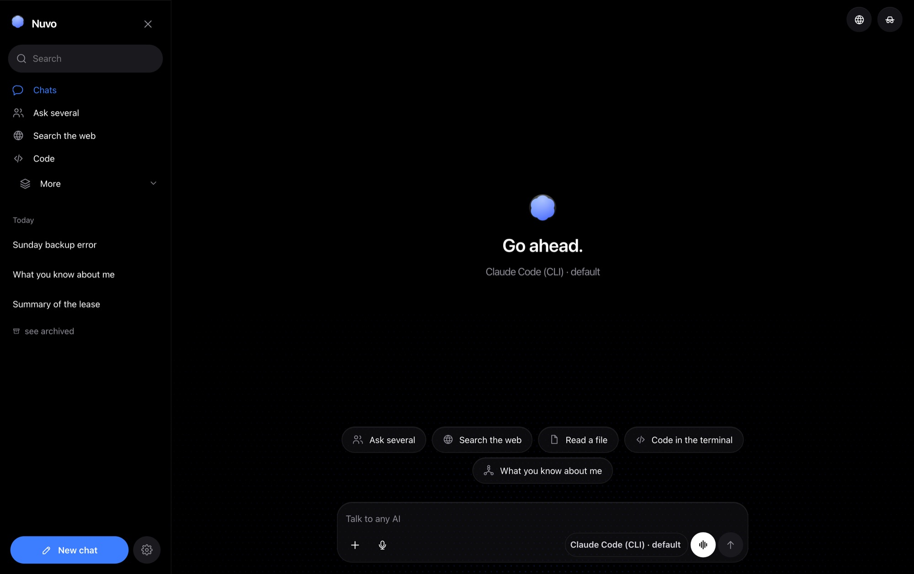
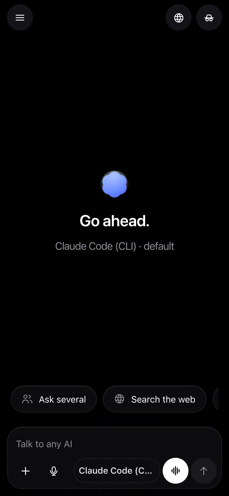

<div align="center">

# Nuvo

**An AI server for your own machine — local models, API models and terminal AIs
in one interface, all sharing the same memory.**

What you told Claude, GPT knows in the next conversation.

[](#requirements)
[](#requirements)
[](#tests)
[](#running-it)
[](#languages)
[](LICENSE)



</div>

---

Runs on Windows, macOS and Linux. Open it in the browser on your computer, and
install it as an app on your phone over the local network.



## Requirements

Node 22.5 or newer. Nothing else: the project uses `node:sqlite`, built into
Node, so **there is nothing to install** and no native compilation.

## Running it

```bash
node bin/nuvo.mjs
```

The server prints the local address and the network one, access token included:

```
Nuvo is up
local:    http://localhost:4747/?token=...
network:  http://10.0.0.72:4747/?token=...
```

Open the network address on your phone and use "Add to Home Screen" to install
it as an app.

| Option | Effect |
| --- | --- |
| `--port 4747` | change the port |
| `--host 0.0.0.0` | change the listening address |
| `--token` | print the token and exit |
| `--no-token` | turn the token off (trusted networks only) |
| `--com-token` | turn it back on |

Everything of yours lives in `~/.nuvo`: the database (`data.db`), the
configuration (`config.json`, created with permission 600), attachments
(`uploads/`) and the automatic copies (`backups/`).

## Operating it

```bash
node bin/nuvo.mjs instalar-servico   # start with the machine
node bin/nuvo.mjs servico            # installed? running?
node bin/nuvo.mjs remover-servico
```

launchd on macOS, `systemd --user` on Linux, Task Scheduler on Windows — all in
the user's scope, no administrator password. On Linux the command tries
`loginctl enable-linger`; without it the server only stays up while a session is
open, and the output says so.

### An icon in the dock

```bash
node bin/nuvo.mjs instalar-app   # Linux and Windows: shortcut with an icon
node bin/nuvo.mjs remover-app
```

This is not Electron: bundling a Chromium for the sake of appearance would cost
hundreds of megabytes and become the project's first dependency.

On macOS, the `Nuvo.app` from the releases opens a **native window** — a
`WKWebView` in an `NSWindow`, 136 kB compiled from `build/janela.swift` at
packaging time. It is Nuvo's icon in the Dock and "Nuvo" in Cmd+Tab; Chrome is
not part of the story. It starts the server if nobody is answering on the port,
and only shuts it down on close if it was the one that started it — someone with
`nuvo` running in a terminal does not lose the session by closing the window. A
link outside `127.0.0.1` opens in the real browser. Packaging without `swiftc`
on the machine returns the older bundle, which opens through the browser.

`instalar-app` is the other route, and remains the only one on Linux and
Windows. On macOS it recognises the release bundle and does not write over it —
both live at `~/Applications/Nuvo.app`, and swapping one for the other would
give back the browser window with nobody understanding why. What it does: open
the browser you already have in app mode — a window with no address bar and no
tabs — pointed at the server. On Linux it writes a `.desktop` entry in the menu;
on Windows, a Start Menu shortcut. With no Chrome/Edge/Brave installed, it opens
in an ordinary tab of the default browser.

Both confirm that whoever is answering on the port really is Nuvo
(`GET /api/ping`, the only route without a token) before opening the window: the
address carries the access token, and handing it to any program that happened to
take the port would be handing over the key to the house.

### Backup

```bash
node bin/nuvo.mjs backup [file.zip]   # database + config + attachments
node bin/nuvo.mjs restore file.zip
node bin/nuvo.mjs backups             # the automatic copies
```

One copy a day is made on its own when the server starts, and the last seven are
kept. In the interface, the same thing lives under Settings → Backup.

The database comes out through `VACUUM INTO`, not a file copy: with WAL on, the
`.db` by itself can be behind what has already been written. Restoring validates
signature and header before touching anything, keeps the current database as
`data.db.antes-da-restauracao` and asks for a restart — the running process
still has the old database open.

### Access token

The token is required by default and covers everything except `GET /api/ping`.
Turning it off is possible — `--no-token`, or the switch under Settings → Access
— but the decision is recorded and applies to later starts, so the server warns
on every start while it is off. To turn it back on: `--com-token`, or the same
switch on screen.

When turned back on from the screen, the server returns the token in the
response and the browser stores it. Without that the button would be a trap: the
next request from the very tab that pressed it would get a 401. Other devices
need the token, which shows in the terminal and in `nuvo --token`.

### When no answer comes back

Under Providers, **Test all** talks to each one and writes the result on its
card. A CLI provider is tested by running the binary, not by reading the
configuration; an API is tested by listing models.

The error that reaches the conversation is translated into an instruction:
"Ollama did not answer on localhost:11434, open the Ollama app", "the key was
refused, generate a new one", "the provider asked you to wait, or switch
models". The provider's raw message goes along, in parentheses.

A model that hangs is cut off: 240 s until the first chunk of the answer (a
large local model takes a while to load into memory) and 120 s between chunks.
Whatever had already arrived is stored as an interrupted answer. Both deadlines
live in `config.json`, under `limits`.

## Tests

```bash
npm test
```

203 tests on Node's own runner, with no test dependency. Each file runs in a
temporary `NUVO_HOME` and replaces the global `fetch`, so nothing touches the
real database or the network.

## Providers

On the first start the server scans the machine on its own: known ports of local
servers and AI binaries on the `PATH`.

| Type | Covers |
| --- | --- |
| `openai` | OpenAI, Groq, DeepSeek, OpenRouter, xAI, Mistral, LM Studio, llama.cpp, vLLM, LocalAI |
| `anthropic` | Anthropic's API |
| `google` | Gemini |
| `ollama` | Ollama |
| `cli` | Claude Code, Codex, Gemini CLI, OpenCode — any binary that takes a prompt |

The API key is written to `config.json` and **never leaves the server**: the API
exposes only whether a key exists (`has_secret`), never the value.

A CLI provider is configured with JSON, using `{{prompt}}` and `{{model}}` in
the arguments:

```json
{ "command": "claude", "args": ["-p", "{{prompt}}"], "stdin": true, "models": ["default"] }
```

## Shared memory

This is the core of the project. A single store of facts, read and written by
any model, regardless of which one answered.

- **Hybrid retrieval** — FTS5 (BM25) always, plus cosine similarity when an
  embedding model is configured. Without embeddings the app keeps working, just
  with less precision;
- **Automatic writing** — after each answer, an extractor reads the exchange and
  keeps what is durable. With no extractor model configured, it falls back to a
  local heuristic that makes no network call at all;
- **Pinning** a fact injects it into every conversation, without competing for a
  score;
- **Scope** — a global fact applies everywhere; a project fact only inside that
  project;
- **Import** — a ChatGPT or Claude export (`conversations.json`) becomes memory.
  Only the user's turns are read.

The interface shows, on every answer, what was remembered and what was learned.

## Documents (RAG)

An attachment goes in through the clip, by dragging onto the conversation, or by
pasting into the text field. A project file applies to every conversation in it.

It reads text and code, PDF, DOCX, PPTX and EPUB — the last four with an
extractor of its own, no dependency. A PDF scanned as images has no text to
extract, and the app says so instead of pretending it read it.

A short file goes into the prompt whole. A large one is split into passages,
indexed in FTS5 (plus embeddings when available), and only the relevant passage
goes in — with the file name attached, so the answer can cite its source.

## Web search and deep research

With no API key: search goes out through DuckDuckGo's HTML endpoint, and page
reading strips script, style and navigation before turning it into text.

- **Search in chat** — the globe button turns search on for the conversation:
  every question goes through a search, three pages are read and enter the
  prompt numbered;
- **Deep research** — the model plans 3 to 6 queries, the server searches and
  reads the pages, and the final report cites each claim by source number. A
  page that does not open shows as not opened; with no sources, there is no
  report.

## AI council

The same prompt to several models at once, in three modes:

| Mode | What it does |
| --- | --- |
| compare | the answers side by side, you judge |
| council | the answers plus a synthesis written by a judge model |
| blind vote | each model rates the others' answers without knowing whose is whose, and the result is the average score |

The vote is blind on purpose: a model that knows which answer is its own tends
to vote for it. The order of the candidates changes per juror, derived from the
index — no random draw, which keeps the result reproducible.

## Managing models

An Ollama provider can pull and delete models from the interface, with a
progress bar read from Ollama's own stream.

## Gems and projects

A **gem** is the personality: instructions, preferred model, temperature, mode
(`chat` or `coding`) and whether it reads/writes memory. A **project** groups
conversations, has its own instruction, its own scoped memory and a working
directory, used by the CLI AIs in coding mode.

Each gem has an `unfiltered` flag, which swaps the system prompt for one without
restrictions and, on Gemini, sends `safetySettings: BLOCK_NONE`. On a local
model this genuinely removes the filter. On a hosted API, the provider still
applies its own policy — the flag does not change that.

## Study

One teacher at a time. Inside it, the past assessments and the class material —
and the difference between the two is the product.

**The screen is NotebookLM's, copied on purpose and measured in the browser**:
64px bar, 270 | rest | 270 columns with a 16 gap, radius-16 panel over `#22262b`,
48px source row, 56px tile with a 12px label. Sources on the left, **conversation
in the middle**, studio on the right. The conversation answers from that
teacher's material and cites the file it came from — that is what gives the
other two columns their point. The sides collapse to 56px when the answer needs
the room.

What a literal copy would have thrown away stayed: a collapsed source still says
how many files are past papers, what those papers actually asked, and what was
only covered in class.

Every file has a role, and the screen says which one everywhere it appears:

| Role | What it is |
| --- | --- |
| paper | the document as the teacher handed it out |
| content | what that paper actually asked for |
| class | what they taught during the term |

Clicking a file opens it: the text as the extractor stored it, in the middle
column. This is where a bad extraction gives itself away — a PDF that turned
into character soup shows up here, and not three screens later, in a mock exam
that comes out strange for no visible reason.

**The teacher's portrait** comes out of the past papers in two passes: one read
per paper, then a synthesis over all of them. The skeleton was not invented — it
is the table of specifications used to build a real exam: content × cognitive
level (Bloom) × question format × weight. It is verifiable, which "the teacher's
style" is not: every finding comes with the literal passage from the paper that
supports it, and the screen shows that passage beside it.

A paper is a sample; the class material is the universe. The distance between
the two is what the portrait calls "teaches and has never asked".

Each paper's reading is stored with a fingerprint of the files and the model:
reading five papers takes minutes, and a failure in the synthesis cannot throw
that away. Changing the model or attaching another paper changes the
fingerprint, so the reading is redone.

**The studio** generates ten formats: mock exam, study guide, flashcards, quiz,
summary, mind map, timeline, audio conversation, infographic and slides.
Generation has two hands: NotebookLM reads the material and drafts, and the
chosen AI rewrites the draft with the portrait on top — it is that second step
that turns "a biology mock exam" into "the exam this teacher would set". Neither
is a single point of failure: with NotebookLM off, the second hand reads the
files directly; picking NotebookLM in the selector means there is no second hand.

**The mock exam is an exam, not a report.** It comes out as a sheet, with two
modes and a print button: answer on screen — and the app marks the
multiple-choice itself, from the index of the correct option the generator
returns, and shows what the teacher expected next to what you wrote for the
open questions — or print it blank, with Name, Date, Grade and ruled lines to
write by hand. What the portrait found (topic weight, level, why the question
exists) stays in the answer key: on an exam you are meant to sit, saying "this
one is worth 30%" hands over half the answer.

**The next exam** opens the teacher's screen, with how long is left and the three
generators worth using to study for it. Opening an assessment puts the studio at
its service, and whatever is generated is filed there. A previous year's paper
has its own place, separate from the calendar: it is the best sample there is of
how that teacher asks, and the worst source of content — the syllabus may have
changed.

**Review** uses FSRS-4.5 — difficulty, stability and retrievability per card. It
is what NotebookLM and the competitors do not have: they generate material and
stop there.

## Structure

```
bin/nuvo.mjs      command-line entry point
server/
  index.mjs            HTTP: static files, token authentication, routing
  api.mjs              /api routes
  config.mjs           ~/.nuvo, secrets, token
  db.mjs               SQLite + FTS5 schema and migrations
  pending-restore.mjs  swapping the database at startup, when a restore is pending

  chat.mjs             one conversation turn, as an async generator
  complete.mjs         a one-off call to a model, backing off on quota errors
  council.mjs          AI council and blind voting
  memory.mjs           hybrid retrieval, extraction, writing
  vectors.mjs          embeddings, cosine and FTS querying
  documents.mjs        attachment, chunking, passage retrieval
  extract.mjs          text from PDF, DOCX, PPTX, EPUB and code
  visao.mjs            an image read by a model that can see
  texto-do-modelo.mjs  strips the markup a model invents

  estudos.mjs          teacher, folders, outputs and each paper's stored reading
  retrato.mjs          the teacher's portrait: specification table from the papers
  estudos-formatos.mjs the studio's ten formats, in two hands
  cartoes.mjs          flashcards and the review queue
  fsrs.mjs             FSRS-4.5, a pure function

  web.mjs              search and page reading
  research.mjs         deep research with a report
  navegador.mjs        Chrome driven over CDP, with its own profile
  agente-web.mjs       the browsing agent: cheap AI to walk, good AI to answer
  notebooklm.mjs       NotebookLM driven through its own screen
  chromium.mjs         downloading Chrome for Testing when no browser is present

  loja.mjs             storefront of MCPs and skills, pulled from GitHub
  catalogo-hf.mjs      catalogue of local models from Hugging Face
  machine.mjs          what the machine can actually run
  discovery.mjs        port and binary scanning
  importers.mjs        reading ChatGPT/Claude/Gemini exports
  backup.mjs           zip written by hand, copy and restore
  service.mjs          launchd, systemd and Task Scheduler
  desktop.mjs          shortcut with an icon, in an app window
  instalar.mjs         installing Ollama and friends
  errors.mjs           a provider error translated into an instruction
  erro-traduzivel.mjs  an error that reaches the screen in the screen's language
  idioma.mjs           the server's language
  projeto-arquivos.mjs file tree and attachments inside a project
  eventos-cli.mjs      step by step read from a terminal AI's stream
  empacotado.mjs       what changes when it is a single executable
  providers/           one adapter per provider type
web/
  index.html           the shell
  app.js               chat, sidebar, palette, shortcuts
  core.js              state, API, SSE, interface pieces
  views.js             panels
  view-estudos.js      the Study screen and the ten outputs
  view-code.js         the Code screen and the work panel
  view-loja.js         the store
  dialogo.js           a dialog of its own, over <dialog>
  i18n.js              screen translation
  lugar.js             where the person is, from the time zone
  md.js                Markdown and code highlighting
  icons.js             SVG icons
  glow.js              the convergence signal
  sw.js                service worker
```

A provider adapter implements `listModels(ctx)` and `stream(ctx, req)` — an
async generator emitting `{delta}`, `{reasoning}` and `{usage}` — and optionally
`embed(ctx, req)` and `check(ctx)`, for when listing models does not prove the
provider works.

## API

Every route requires the `x-nuvo-token` header (or `?token=`).

| Route | Does |
| --- | --- |
| `GET /api/state` | providers, gems, projects, conversations and configuration |
| `POST /api/discover` | scans the machine for local AI |
| `POST /api/providers` | registers a provider (`secretValue` is stored, never returned) |
| `POST /api/chats/:id/stream` | the answer over SSE |
| `GET/POST /api/memories` | lists and writes facts |
| `POST /api/memories/import` | imports another AI's export |
| `POST /api/chats/:id/regenerate` | redoes the last answer (SSE) |
| `POST /api/chats/:id/attachments` | attaches a file (raw body, name in the query) |
| `GET /api/chats/:id/export` | exports as `md` or `json` |
| `POST /api/research` | deep research (SSE) |
| `POST /api/council` | AI council (SSE) |
| `POST /api/providers/:id/pull` | pulls an Ollama model (SSE) |
| `GET /api/search` | searches messages and memory |
| `GET/PATCH /api/settings` | memory and access configuration |
| `GET /api/ping` | the only route without a token: says only that this is a Nuvo |
| `GET /api/health` | tests each provider and says what is wrong |
| `GET /api/backup` | downloads the zip with database, configuration and attachments |
| `POST /api/restore` | restores from a zip (raw body); asks for a restart |

The chat stream emits `user`, `memory-used`, `docs-used`, `web-used`, `phase`,
`reasoning`, `delta`, `stats`, `done`, `memory-new`, `error` and `end`.

## Interface

No build step: HTML, CSS and ES modules served directly.

- Real Markdown — heading, list, table, quote, link, and code block with
  highlighting and a copy button;
- the model's reasoning in a collapsed block, when the provider exposes it;
- measurement per answer: time to first token, tokens per second and total
  (marked as estimated when the provider does not return the count);
- regenerate, edit, copy and delete a message;
- per-conversation settings: system prompt, temperature, top_p, token limit;
- search across everything ever discussed, and across memory, through the FTS5
  index;
- export a conversation as Markdown or JSON;
- voice: dictation and reading the answer aloud, through the browser's own APIs;
- rename a conversation in place of its label, pin and archive, with a separate
  list for the archived ones;
- a guided first run when there is no model at all yet;
- light and dark themes, a command palette (Ctrl/Cmd+K) and shortcuts;
- its own SVG icons — no emoji, which are drawn differently on every system.

### Languages

Portuguese, English and Spanish. The default comes, in this order, from what the
person picked in the selector, the country inferred from the time zone, the
browser's `Accept-Language`, and the system language — with no IP lookup at any
step.

`NUVO_LANG` forces the language, for both server and screen, above all of that:

```sh
NUVO_LANG=en nuvo
```

It exists to check a translation without changing the machine's language. It
also decides the language of the four profiles that ship on first start — they
are written to the database as user data, so they are born correct instead of
being translated at draw time, which would undo any renaming.

## What it does not do

- **It ships no model.** Nuvo drives what is on the machine or behind a key you
  already have. With nothing installed and no key, the first-run screen has
  nothing to offer.
- **It is not multi-user.** One person, one machine, one token. There are no
  accounts and no per-user separation.
- **It is not hardened for the open internet.** The token protects a home
  network; exposing the port to the world is not a supported setup.
- **A hosted provider's policy still applies.** The `unfiltered` flag changes
  Nuvo's prompt, not the vendor's rules.
- **A scanned PDF has no text.** There is no OCR; the app says so rather than
  returning nothing and calling it a read.
- **NotebookLM is driven through its own screen**, so a change on Google's side
  can break that path. Everything else keeps working without it.

## Links

- Project page: <https://www.nspx.dev/Nuvo/>
- Releases: <https://github.com/NspxMiguel/Nuvo/releases>

## License

MIT — see [LICENSE](LICENSE).

<div align="center">

Made by [@NspxMiguel](https://github.com/NspxMiguel) · [nspx.dev](https://www.nspx.dev)

</div>
